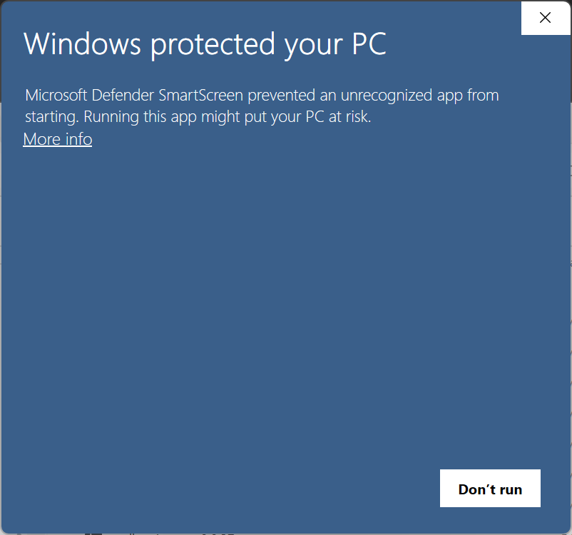
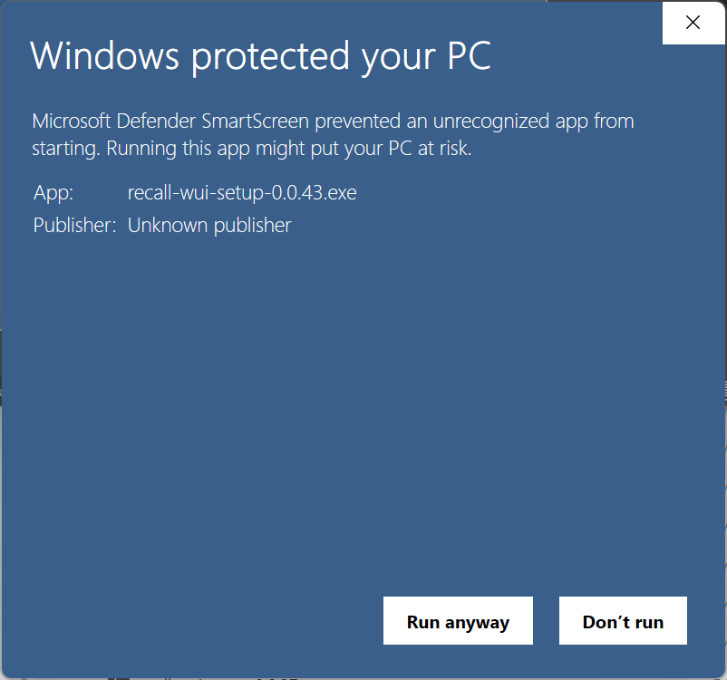
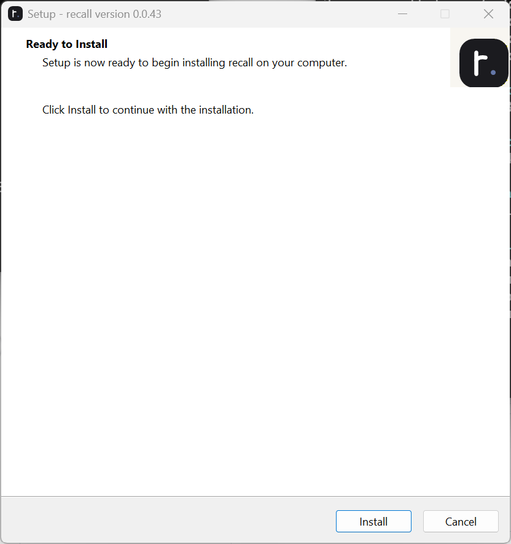
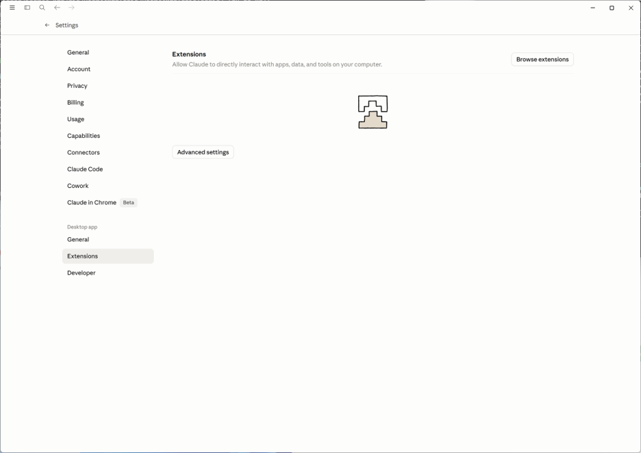
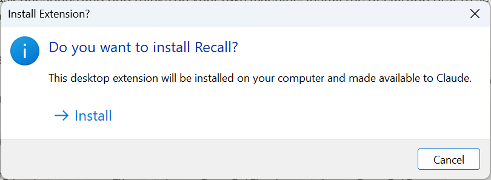
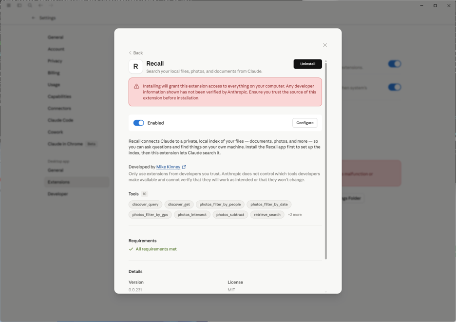

# Installing Recall

This guide walks through installing **Recall** on Windows. Installation
is a two-stage process:

1. Run the Recall setup installer (installs the desktop app and the
   `.mcpb` extension package).
2. Install Recall as a desktop extension inside Claude so Claude can
   call into it.

---

## Requirements

- Windows 10 (22H2) or Windows 11
- Claude Desktop installed and signed in
- An account on the machine with permission to install applications

> Recall runs entirely locally. No account sign-up is required to
> install or use it.

---

## 1. Run the installer

You will receive a download link from the maintainer for
`recall-wui-setup-<version>.exe`. Double-click the installer.

Because Recall is not code-signed by a registered publisher, Windows
SmartScreen shows **"Windows protected your PC"** the first time you
run it:

Click **More info**. The dialog expands to show the app name
(`recall-wui-setup-<version>.exe`) and a **Run anyway** button:

Click **Run anyway**. If a User Account Control prompt appears, click
**Yes**.

---

## 2. Confirm the install

The Recall setup wizard opens at **Ready to Install**.

Click **Install**. Installation typically takes a few seconds.

---

## 3. Finish the wizard and copy the extension path

When the installer finishes, the wizard shows **Completing the recall
Setup Wizard**. This screen contains everything you need for stage two
— don't dismiss it yet.

The page shows the folder where `recall-windows-x64.mcpb` was placed
(under your local AppData). You have two options:

- Click **Copy to Clipboard** to copy the folder path, or
- Click **Open this folder in Explorer** to open it directly.

Leave **Launch recall** checked and click **Finish**.

---

## 4. Open Claude → Settings → Extensions

In the Claude desktop app:

1. Click your name in the lower-right corner and choose **Settings**.
2. In the left-hand sidebar, under the **Desktop app** section, click
   **Extensions**.

Click **Advanced settings**, then **Install Extension**. A file picker
titled **Select extension** opens.

---

## 5. Pick the Recall extension package

In the file picker, navigate to the folder you copied from the setup
wizard (paste it into the address bar at the top of the dialog). You
should see exactly one selectable file: **recall-windows-x64.mcpb**.

Select it and click **Preview**.

---

## 6. Review the extension and install

Claude shows the extension's detail page: name, description, tool list
(`discover_query`, `discover_get`, `photos_filter_by_*`, `retrieve_search`,
etc.), version, author, and a requirements check.

> **Note:** Claude displays a warning that extensions can access
> everything on your computer and that developer info is not verified
> by Anthropic. Only install Recall if you trust the source you got
> the installer from.

Click **Install** in the upper-right of the detail page. Windows then
asks for final confirmation:

Click **Install**. The extension is registered with Claude and its
tools become available immediately.

---

## 7. You're done

Back on the extension detail page, the toggle now reads **Enabled** and
the **Install** button has been replaced by **Uninstall**.

Start a new conversation in Claude and ask it to search your files,
photos, or documents — Claude will route the request through Recall's
tools.

---

## Uninstalling

**Remove the extension from Claude:** open **Settings → Extensions**,
click into Recall, and click **Uninstall** (see the screenshot above).
You can also flip the **Enabled** toggle off to disable Recall
temporarily without removing it.

**Remove the Recall app:** open **Settings → Apps → Installed apps**,
find **recall**, and choose **Uninstall**. Your index database and
configuration under `%LOCALAPPDATA%\recall\` are left in place — delete
that folder manually if you also want to remove indexed data.

---

## Troubleshooting

- **SmartScreen has no "Run anyway" button:** make sure you clicked
  **More info** first — the button only appears after the dialog
  expands.
- **Installer won't launch at all:** right-click the `.exe` →
  **Properties** → check **Unblock** at the bottom → **Apply**, then
  retry.
- **`recall-windows-x64.mcpb` isn't visible in the file picker:**
  confirm you navigated to the exact folder shown on the setup wizard's
  final screen, and that the file-type dropdown in the lower-right of
  the dialog is set to **Extensions (\*.dxt;\*.mcpb)**.
- **Claude doesn't seem to use Recall:** open **Settings → Extensions
  → Recall** and confirm the **Enabled** toggle is on and that
  **Requirements** shows *All requirements met*.
